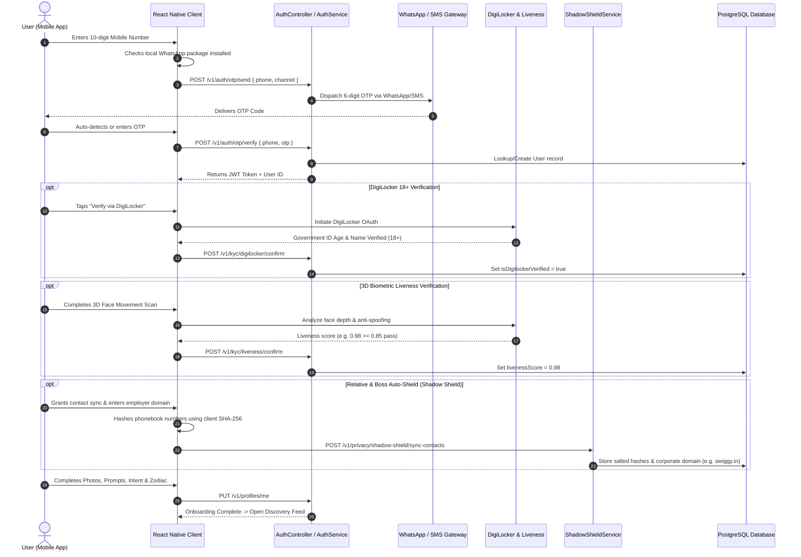
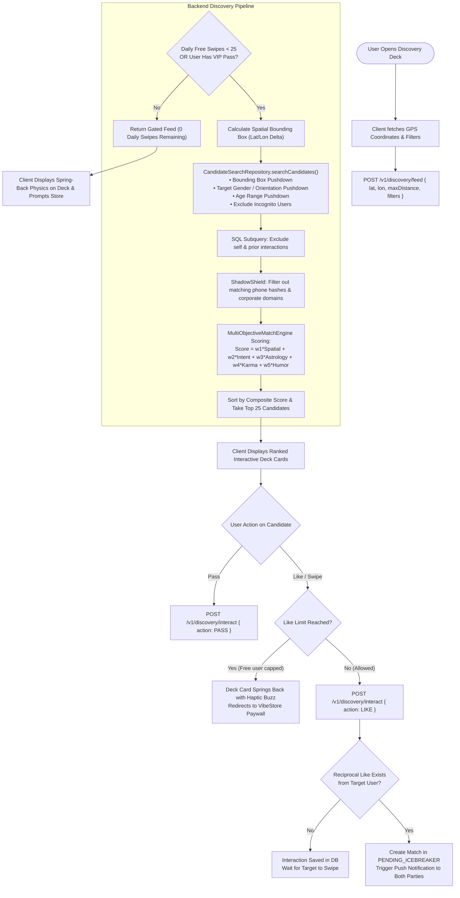
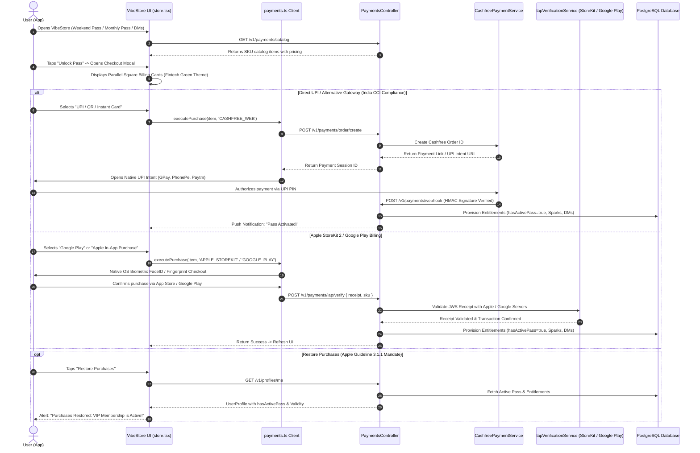
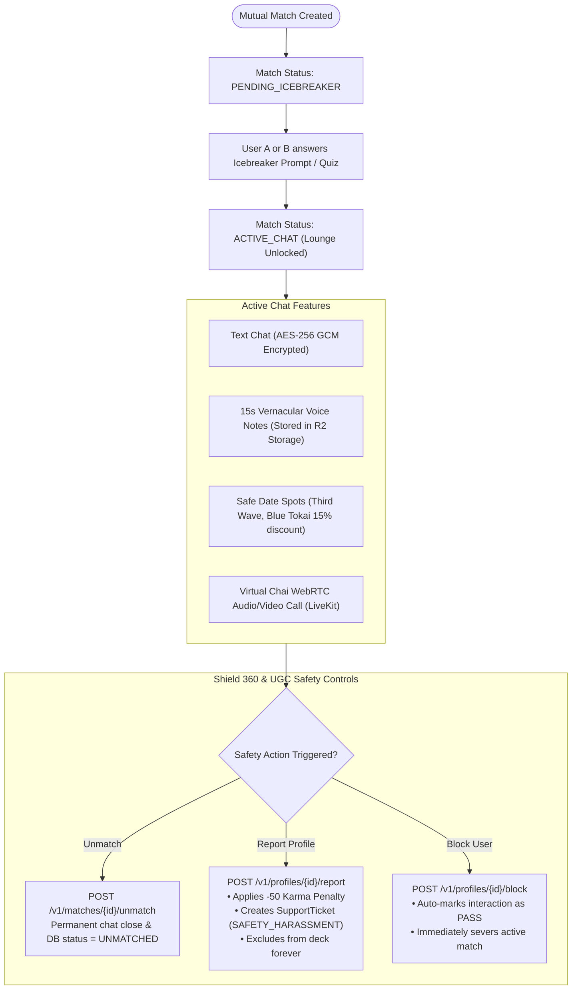
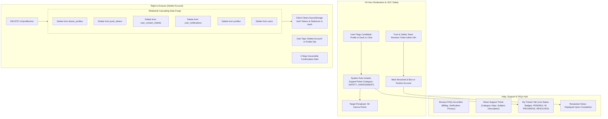
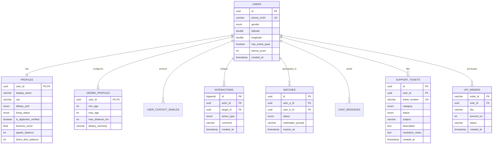

# 🌶️ Blunderr Dating (SwipeAI) — Production Backend Engine

> **High-Intent Modern Dating Platform with 3D Biometric Liveness, Shadow Shield Privacy, Dual-Rail User Choice Billing, and End-to-End Encrypted Real-Time Messaging.**


---

## 📖 Table of Contents
1. [Tech Stack & Architecture Highlights](#-tech-stack--architecture-highlights)
2. [Quickstart & Running Locally](#-quickstart--running-locally)
3. [System Architecture & Component Flow Diagrams](#-system-architecture--component-flow-diagrams)
   - [1. High-Level Full-Stack System Architecture](#1-high-level-full-stack-system-architecture)
   - [2. User Onboarding, Authentication & KYC Flow](#2-user-onboarding-authentication--kyc-flow)
   - [3. Discovery Feed & Multi-Objective Ranking Pipeline](#3-discovery-feed--multi-objective-ranking-pipeline)
   - [4. Dual-Rail Monetization (User Choice Billing India)](#4-dual-rail-monetization-user-choice-billing-india)
   - [5. Chat Lounge, Safe Date Spots & Shield 360 Moderation](#5-chat-lounge-safe-date-spots--shield-360-moderation)
   - [6. Trust & Safety Support Hub & Right to Erasure Flow](#6-trust--safety-support-hub--right-to-erasure-flow)
   - [7. Relational Database Schema (ER Diagram)](#7-relational-database-schema-er-diagram)
4. [Core API Endpoint Catalog](#-core-api-endpoint-catalog)
5. [Environment Variables Reference](#-environment-variables-reference)

---

## ⚡ Tech Stack & Architecture Highlights

* **Core Runtime:** Java 21 (LTS) with Spring Boot 3.x utilizing Loom Virtual Threads for ultra-high concurrency.
* **Database & Search:** PostgreSQL 16 with spatial bounding-box pushdown (`idx_users_spatial_coord`, `idx_users_discovery`), eliminating full-table scans.
* **Privacy & Security (Shadow Shield):** Zero-Knowledge client contact hashing (salted SHA-256) and corporate email domain blocking (e.g., `swiggy.in`, `tcs.com`, `infosys.com`) to guarantee complete bi-directional invisibility from family, relatives, neighbors, and coworkers.
* **Trust & Identity:** DigiLocker 18+ Government ID age verification combined with 3D Biometric Facial Liveness checks to permanently eliminate catfish accounts.
* **Real-time Messaging & Calls:** End-to-End Encrypted (AES-256-GCM) 1-on-1 chat lounges, 15s Vernacular Audio Notes (Cloudflare R2 Object Storage), and masked WebRTC Virtual Chai calling powered by LiveKit Cloud.
* **Dual-Rail Monetization (User Choice Billing India):** Fully compliant with the Competition Commission of India (CCI) ruling and Google Play User Choice Billing—offering direct UPI/QR through Cashfree alongside Apple StoreKit 2 and Google Play Billing, complete with an Apple Guideline 3.1.1 compliant **"Restore Purchases"** mechanism.
* **Regulatory Compliance:** Built-in 1-tap Account Deletion (Right to Erasure / DPDP Act), in-app Report & Block for UGC safety (Apple Review Guideline 1.2), and a 24-hour SLA Support Ticketing Hub.

---

## 🚀 Quickstart & Running Locally

### Prerequisites
* JDK 21+ (`openjdk 21` or `temurin-21`)
* PostgreSQL 16+ running on `localhost:5432` with database `swipeai`

```bash
# Clone and enter directory
cd /Users/sunilsingh/Workspace/SwipeAI

# Set environment variables (or copy .env.example)
export SPRING_DATASOURCE_URL=jdbc:postgresql://localhost:5432/swipeai
export SPRING_DATASOURCE_USERNAME=postgres
export SPRING_DATASOURCE_PASSWORD=postgres
export JWT_SECRET=your_super_secret_jwt_hmac_256_bit_key_here_must_be_long
export CASHFREE_APP_ID=test_cashfree_app_id
export CASHFREE_SECRET_KEY=test_cashfree_secret_key

# Compile and verify build
./gradlew compileJava

# Run Spring Boot backend server on port 8080
./gradlew bootRun

# Run full CRUD & integration test suite
./gradlew test
```

---

## 📊 System Architecture & Component Flow Diagrams

### 1. High-Level Full-Stack System Architecture

```mermaid
flowchart TD
    subgraph Client["📱 Frontend Client (React Native / Expo v57)"]
        UI_AUTH["Auth & KYC\n(WhatsApp OTP, DigiLocker, 3D Liveness)"]
        UI_FEED["Discovery Feed Deck\n(Card Swipe, Spring-Back Gating)"]
        UI_CHAT["Chat Lounge & Calls\n(AES-256 GCM, Virtual Chai WebRTC)"]
        UI_STORE["VibeStore & Passes\n(Dual-Rail Paywall, Restore Purchases)"]
        UI_PROFILE["Profile & Shield Center\n(Desire Profile, Contact Hashing)"]
        UI_SUPPORT["Help & Support Hub\n(FAQs, Ticket Tracking, Account Erasure)"]
    end

    subgraph Gateway["🌐 API & Security Gateway"]
        TLS["HTTPS / WSS Gateway (Cloudflare / Nginx Reverse Proxy)"]
        JWT_FILTER["JWT Bearer Authentication Filter (Stateless Principal Extraction)"]
        RATE_LIMIT["Rate Limiting & DDOS Shield (25 Swipes Hard Cap, OTP Brute-force Block)"]
    end

    subgraph Backend["⚙️ Spring Boot 3.x Backend Architecture"]
        subgraph Controllers["REST Controllers"]
            C_AUTH["AuthController & ProfileController"]
            C_FEED["DiscoveryController & MatchController"]
            C_CHAT["ChatController & CallingController"]
            C_PAY["PaymentsController & SupportController"]
        end

        subgraph CoreServices["Service Layer"]
            S_AUTH["AuthService & ProfileService"]
            S_FEED["DiscoveryService & MatchService"]
            S_CHAT["ChatService & LiveKitCallingService"]
            S_PAY["UpiPaymentService & CashfreePaymentService\nIapVerificationService & SupportService"]
        end

        subgraph Engines["Intelligence & Security Engines"]
            E_RANK["MultiObjectiveMatchEngine\n(Spatial + Age + Intent Ranking)"]
            E_SHIELD["ShadowShieldService\n(Salted SHA-256 Contact Blocker)"]
            E_COSMIC["CosmicChemistryEngine\n(Astrological Synastry & Vibe Cards)"]
            E_CRYPTO["ChatCryptoService & Liveness\n(AES-256-GCM End-to-End Encryption)"]
        end
    end

    subgraph DataTier["💾 Persistence & Cache Tier"]
        DB_POSTGRES[("PostgreSQL 16 Database\n(Users, Profiles, Matches, Chats, Tickets, Orders)")]
        STORAGE_R2[("Cloudflare R2 Object Storage\n(Encrypted Voice Notes & Watermarked Photos)")]
    end

    Client -->|HTTPS REST & WS| Gateway
    Gateway --> Controllers
    Controllers --> CoreServices
    CoreServices --> Engines
    CoreServices --> DataTier
    Engines --> DataTier
```



---

### 2. User Onboarding, Authentication & KYC Flow



---

### 3. Discovery Feed & Multi-Objective Ranking Pipeline



---

### 4. Dual-Rail Monetization (User Choice Billing India)



---

### 5. Chat Lounge, Safe Date Spots & Shield 360 Moderation



---

### 6. Trust & Safety Support Hub & Right to Erasure Flow



---

### 7. Relational Database Schema (ER Diagram)



---

## 📡 Core API Endpoint Catalog

| Module | Method & Path | Description | Security & Policy |
| :--- | :--- | :--- | :--- |
| **Auth** | `POST /v1/auth/otp/send` | Dispatches 6-digit verification code via WhatsApp or SMS | Public (Rate Limited) |
| **Auth** | `POST /v1/auth/otp/verify` | Validates OTP and issues stateless JWT authorization token | Public |
| **Profile** | `GET /v1/profiles/me` | Fetches private profile, VIP pass status, and token balances | JWT Bearer |
| **Profile** | `PUT /v1/profiles/me` | Updates photos, bio, dietary preferences, and relationship intent | JWT Bearer |
| **Profile** | `DELETE /v1/profiles/me` | Cascading relational purge across all 6 data tables (DPDP Act) | JWT Bearer (Apple 5.1.1(v)) |
| **UGC Safety** | `POST /v1/profiles/{id}/report` | Reports objectionable profile, docks -50 karma & creates ticket | JWT Bearer (Apple Guideline 1.2) |
| **UGC Safety** | `POST /v1/profiles/{id}/block` | Blocks candidate and permanently excludes from discovery deck | JWT Bearer (Apple Guideline 1.2) |
| **Discovery** | `POST /v1/discovery/feed` | Fetches ranked candidates using spatial bounding box & AI score | JWT + 25 Swipes Hard Cap |
| **Discovery** | `POST /v1/discovery/interact` | Records Like, Pass, or Super Chai; triggers auto-match | JWT + Entitlement Gating |
| **Matches** | `GET /v1/matches` | Returns active matches, icebreakers, and expiring connections | JWT Bearer |
| **Matches** | `POST /v1/matches/{id}/unmatch`| Severs match connection and closes conversation history | JWT Bearer |
| **Payments** | `GET /v1/payments/catalog` | Returns catalog passes (Weekend, Monthly, Sachet DMs) | JWT Bearer |
| **Payments** | `POST /v1/payments/order/create`| Initiates Cashfree UPI order for alternative billing in India | JWT Bearer (Google Play UCB) |
| **Payments** | `POST /v1/payments/webhook` | Verifies Cashfree payment gateway HMAC-SHA256 signature | Signature Header Verified |
| **Payments** | `POST /v1/payments/iap/verify` | Validates Apple StoreKit 2 / Google Play purchase receipts | JWT Bearer |
| **Support** | `GET /v1/support/faqs` | Returns categorized FAQs (Billing, KYC, Privacy, Matching) | JWT Bearer |
| **Support** | `POST /v1/support/tickets` | Raises support or safety violation ticket with tracking number | JWT Bearer (Apple Guideline 1.2) |

---

## ⚙️ Environment Variables Reference

| Variable | Description | Default / Example |
| :--- | :--- | :--- |
| `SPRING_DATASOURCE_URL` | PostgreSQL connection URL | `jdbc:postgresql://localhost:5432/swipeai` |
| `SPRING_DATASOURCE_USERNAME` | PostgreSQL database user | `postgres` |
| `SPRING_DATASOURCE_PASSWORD` | PostgreSQL database password | `postgres` |
| `JWT_SECRET` | Secret key for HS256 HMAC JWT signing | `64-character-hex-or-base64-secret` |
| `CASHFREE_APP_ID` | Cashfree payment gateway client ID | `TEST_CF_APP_ID` |
| `CASHFREE_SECRET_KEY` | Cashfree payment gateway secret | `TEST_CF_SECRET_KEY` |
| `CASHFREE_ENV` | Cashfree environment (`SANDBOX` or `PRODUCTION`)| `SANDBOX` |
| `LIVEKIT_API_KEY` | LiveKit WebRTC Cloud API Key | `devkey` |
| `LIVEKIT_API_SECRET` | LiveKit WebRTC Cloud Secret Key | `secret` |
| `R2_ACCESS_KEY_ID` | Cloudflare R2 / S3 access key | `cloudflare_r2_access_key` |
| `R2_SECRET_ACCESS_KEY` | Cloudflare R2 / S3 secret key | `cloudflare_r2_secret_key` |

---

*Blunderr Dating (SwipeAI) • Engineering & Regulatory Compliance Playbook*
